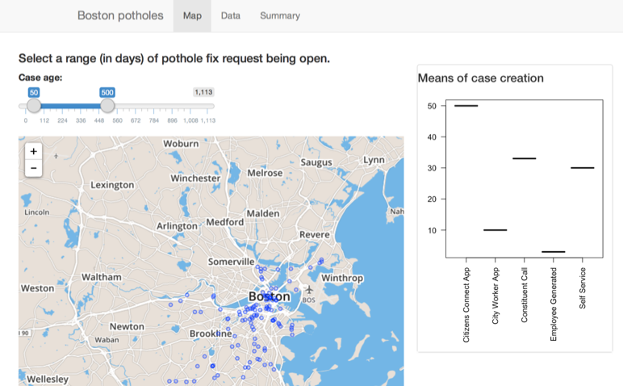

## Project Details

"Boton Potholes" project is about exploring closed potholes cases.


* Project goals: 
  * Provide a way to browse and filter the data
  * To understand how quickly open cases were closed 
  * How cases were reported.
  * Plot closed cases on the map

The data is available online: https://data.cityofboston.gov/City-Services/Closed-Pothole-Cases/wivc-syw7

--- .class #id 

## Quick look at the data

```{r block1}
potholes <- read.csv("../Closed_Pothole_Cases.csv")
names(potholes)
```

---
## Exploring closed cases lifetime distribution

```{r echo=FALSE, fig.height=5, fig.width=14}
potholes$OPEN_DATE <- as.Date(potholes$OPEN_DT, "%m/%d/%Y")
potholes$CLOSED_DATE <- as.Date(potholes$CLOSED_DT, "%m/%d/%Y")
potholes$CASE_OPEN <- potholes$CLOSED_DATE - potholes$OPEN_DATE
par(mfrow=c(1,2))
hist(as.integer(potholes$CASE_OPEN), xlab="Case life (in days)", main="Case 'lifetime' distribution", breaks=30)
hist(as.integer(potholes$CASE_OPEN[1:length(potholes)]), xlab="Case life (in days)", main="Case with 'lifetime' >0  distribution", breaks=30)
```

Quite interesting... the majority of open cases are closed the same day. 

My suspition is that  just before the whole line/road is to be fixed, a road team opens pothole cases for everything the see on the road, and then closes them almost immidiately.

---
## Demo time



https://xander.shinyapps.io/BostonPotholes/

