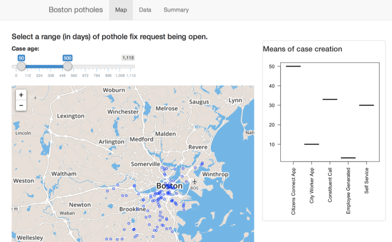

## Project Details

"Boton Potholes" project is about exploring closed potholes cases.


* Project goals: 
  * Provide a way to browse and filter the data
  * To understand how quickly open cases were closed 
  * How cases were reported.
  * Plot closed cases on the map

The data is available online: https://data.cityofboston.gov/City-Services/Closed-Pothole-Cases/wivc-syw7

--- .class #id 

## Quick look at the data


```r
potholes <- read.csv("../Closed_Pothole_Cases.csv")
names(potholes)
```

```
##  [1] "CASE_ENQUIRY_ID"                "OPEN_DT"                       
##  [3] "CLOSED_DT"                      "CASE_STATUS"                   
##  [5] "CLOSURE_REASON"                 "CASE_TITLE"                    
##  [7] "SUBJECT"                        "REASON"                        
##  [9] "TYPE"                           "QUEUE"                         
## [11] "Department"                     "Location"                      
## [13] "fire_district"                  "pwd_district"                  
## [15] "city_council_district"          "police_district"               
## [17] "neighborhood"                   "neighborhood_services_district"
## [19] "ward"                           "precinct"                      
## [21] "land_usage"                     "LOCATION_STREET_NAME"          
## [23] "LOCATION_ZIPCODE"               "Property_Type"                 
## [25] "Property_ID"                    "LATITUDE"                      
## [27] "LONGITUDE"                      "Source"                        
## [29] "Geocoded_Location"
```

---
## Exploring closed cases lifetime distribution

 

Quite interesting... the majority of open cases are closed the same day. 

My suspition is that  just before the whole line/road is to be fixed, a road team opens pothole cases for everything the see on the road, and then closes them almost immidiately.

---
## Demo time



https://xander.shinyapps.io/BostonPotholes/

